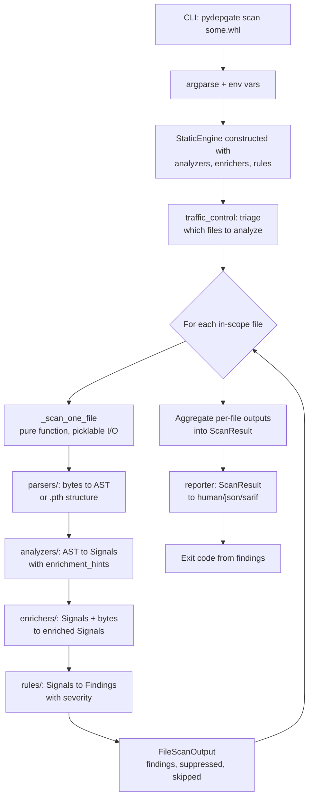

# Contributing to pydepgate

Thanks for considering a contribution. pydepgate is a single-author
project on a side-project schedule, so this document tries to set
realistic expectations about what gets accepted, what gets pushed
back on, and what makes a PR easy versus hard to review.

The short version: documentation, bug fixes, false-positive fixes,
new tests for evasion shapes, and well-scoped detection improvements
are all welcome. Architectural changes to the analyzer pipeline, the
rules engine, or the engine's parallelism contract need a discussion
first because they have ripple effects on the rest of the codebase.

## Before you open anything

Before opening a pull request, please open an issue. This is not a
gatekeeping ritual. It's how we avoid the failure mode where you
spend an evening writing code that does not match what the project
needs, and I spend an evening explaining why I cannot merge it.

For bug reports, false positives, and small fixes, the issue can be
short. For new analyzers, new rules, or anything that touches more
than one module, the issue should describe the shape of the change
and the test cases you have in mind. I will respond within a few
days, sometimes faster, occasionally slower if the radiator factory
runs long.

If the change is small and obvious (a typo, a docstring fix, a clear
one-line bug), feel free to skip the issue and open the PR directly.
The line for "small and obvious" is roughly: would I, the maintainer,
have written this exact change myself if I had noticed the problem?

## Sign your commits

All commits must be signed off under the Developer Certificate of
Origin. This is a one-time setup: pass `-s` to git commit, or
configure git to do it for you:

```
git config --global format.signoff true
```

Sign-off adds a line to your commit message that looks like
`Signed-off-by: Your Name <your.email@example.com>`. By including
that line, you are attesting to the four points in the DCO at
https://developercertificate.org. In plain English: you wrote the
code or have permission to contribute it, and you are licensing it
under the project's Apache 2.0 license. There is no separate paper
agreement to sign; the sign-off line is the agreement.

PRs without sign-off cannot be merged. GitHub will tell you if a
commit is missing the line.

## What's in scope for outside contributions

Things that are easy to land:

- Documentation fixes, including typos, broken links, missing
  examples, and unclear sentences in the README, SECURITY.md,
  ROADMAP.md, or this file.
- Bug fixes for clearly-broken behavior, with a regression test.
- False-positive fixes where an existing analyzer fires on a known
  benign pattern. Include a fixture demonstrating the false positive
  and a test that asserts the new behavior.
- New tests for evasion shapes that should already be caught but
  aren't. The test can pass after a small analyzer fix you include,
  or it can be marked as expected-fail and I'll write the fix.
- Small enhancements to existing analyzers that close known gaps,
  such as the aliased-import resolution gap documented in the
  Known Limitations section of the README.
- New rules for the default rule set, particularly ones that
  encode file-kind-aware severity decisions for existing signals.

Things that need a design discussion first:

- New analyzers. The analyzer architecture has specific contracts
  (visitor pattern, signal emission shape, picklability) that
  outside contributors are likely to trip over. Open an issue
  describing the detection shape and example fixtures, and we
  can work out the design together before code gets written.
- Changes to the rules engine, the loader, the precedence model,
  or the explanation system.
- Changes to the parsers, the resolver, the visitor base class,
  or any of the shared infrastructure under `analyzers/_*.py`.
- Changes to the static engine itself, especially anything that
  touches `_scan_one_file`, the file scan input/output shapes,
  or the way work is dispatched per-file. See "the picklability
  contract" below.
- New output formats. SARIF is already roadmapped; other formats
  should be discussed before implementation.

Things that won't be accepted:

- New runtime dependencies. pydepgate ships with zero third-party
  runtime dependencies and that's a load-bearing design constraint.
  If your change requires a new dependency, the change needs a
  redesign, not a dependency.
- Anything that executes user-provided code during static analysis.
  The static analyzer never executes input. There are no
  exceptions for "but it's just a small import" or "but it's
  sandboxed." Code execution belongs in the future runtime engine,
  not in the static path.
- Code that has been substantially generated by an LLM without
  your own review and verification. Read the SECURITY.md note on
  this. AI assistance is fine; AI-as-author is not. If you used
  an LLM to draft a change, that's normal in 2026, but you must
  be able to defend every line of the diff as your own work.

## Load-bearing constraints in the codebase

This section is the part of the document I most want contributors
to read carefully. Some of these constraints are not obvious from
reading the code, and breaking them produces failures that are
either silent, security-relevant, or both. Each one is enforced
either by a specific test or by the architecture itself, and each
one has prior art in the existing code for how to extend it
correctly.

If you read nothing else in this document, read this section.

### The picklability contract

The static engine is currently single-threaded but is structured
so that future versions can use a `ProcessPoolExecutor` to scan
multiple files in parallel. The seam where this happens is the
function `_scan_one_file(FileScanInput) -> FileScanOutput` in
`src/pydepgate/engines/static.py`. That function is a pure
function: it takes its input, produces its output, and does not
read or mutate any state outside of its arguments.

For this to work under multiprocessing, three things have to be
true and they're enforced by the test suite, not just by
convention:

1. **Inputs and outputs must be picklable.** `FileScanInput`,
   `FileScanOutput`, every analyzer instance, every enricher
   instance, and every rule must survive a pickle round-trip
   without losing information.
2. **No module-level mutable state.** Analyzers, enrichers, and
   the engine itself must not rely on global variables, lazy
   singletons, or class-level mutable attributes. State that
   needs to persist across files belongs in `FileScanInput` or
   on the engine's own attributes, not in module-scope dicts.
3. **No file-scoped side effects.** A scan of file A must not
   leave any state behind that a scan of file B can observe.
   The same input must always produce the same output.

The test that enforces this is `tests/engines/test_deploy_the_pickle.py`.
It pickles every analyzer, enricher, and rule in the default
configuration and asserts they survive a round-trip. If you are
adding a new analyzer, enricher, or rule, this test must pass for
your addition. If it doesn't pass, the failure mode you'll hit
later (when the engine actually goes parallel) is the kind of bug
that's painful to debug because it manifests as nondeterministic
test failures or wrong findings under load. We catch it now,
cheaply, by enforcing the discipline at every commit.

If your change adds something that's hard to make picklable (a
compiled regex object, an open file handle, a thread-local), the
right answer is almost always to refactor so the unpicklable
thing is constructed at use time inside the analyzer's logic
rather than stored as state. There's prior art in the existing
analyzers for how to do this.

### The safe partial evaluator's no-execution discipline

`src/pydepgate/analyzers/_resolver.py` is the partial evaluator
that lets pydepgate figure out what an obfuscated string
expression resolves to. It supports concatenation, character-code
construction, slicing, `str.join`, `bytes.fromhex().decode()`,
f-string assembly, and a few other operations. Every one of those
operations is reimplemented from scratch using only Python
builtins on values the resolver itself produced.

This is the load-bearing security property of the entire static
analyzer. The reason the analyzer can claim "we never execute
input" is because the resolver never delegates an operation to
the actual runtime. If a contributor adds support for a new
operation by calling the runtime method on the resolved value
(e.g. `value.replace(...)` instead of modeling replace from
scratch), the entire safety property collapses, because an
attacker can construct a value whose `__getattr__` or `__class__`
does something the resolver isn't expecting.

The discipline when extending the resolver: model the operation,
don't delegate to the runtime. If you need to support
`str.replace`, write a function that takes the resolved string
and the literal arguments and produces the replaced string by
hand. Do not call `.replace()` on the resolved object.

The same discipline applies to any new analyzer that needs to
inspect computed values. If you find yourself writing
`getattr(some_resolved_value, 'whatever')`, stop. The correct
pattern is to recognize that you need a new resolver operation,
add it to the resolver with the same no-delegation discipline,
and call the resolver from the analyzer.

If you are uncertain whether a proposed change preserves the
safety property, open an issue and walk me through your design
before writing the code. The cost of a wrong call here is
arbitrary code execution in the analyzer process, which would be
catastrophic for the project's threat model.

### The triage layer's what-gets-analyzed boundary

`src/pydepgate/traffic_control/triage.py` decides which files in
an artifact go through the analyzer pipeline and which file kind
each in-scope file is treated as. This is the boundary between
"we look at this" and "we skip this," and it's also the boundary
between different rule sets, since rules match on file kind.

Changes here have non-obvious consequences in two directions:

**Expanding the analyzed set** by routing more files through the
pipeline can break the picklability contract or surface new
analyzer false positives in contexts where the analyzers weren't
calibrated to run. Deep mode (`--deep`) already opted into this
trade-off explicitly; widening the default-mode set requires the
same explicit trade-off and rule-layer work to avoid noise.

**Shrinking the analyzed set** by routing fewer files through the
pipeline can silently drop detection coverage. If a file kind
that was previously analyzed stops being analyzed, real attacks
in that file kind become invisible. This is the more dangerous
direction because the failure mode is silent: tests still pass,
the scanner runs faster, and nothing alerts you that coverage
shrank.

If you're touching `triage.py`, the PR description must include
an explicit "this changes coverage in [direction] for [file
kinds]" section, and the test suite must include explicit cases
asserting both the new positive (files that should be analyzed
now are) and the new negative (files that should be skipped
aren't). Coverage changes without those tests will not merge.

### The rules engine's precedence model

`src/pydepgate/rules/base.py` and the rules loader in
`rules/loader.py` together implement a specific precedence model
that the rest of the system depends on:

1. Source priority: user rules win over system rules win over
   defaults.
2. Among rules of the same source: more match fields wins
   (specificity).
3. Among ties on source and specificity: load order wins.

This is the contract that makes user rule customization work.
Every user with a `pydepgate.gate` file expects that their rules
override the defaults, regardless of how generic their rule is
or how specific the default is. A contributor who reorders the
precedence logic (even as a bug fix) can break this expectation
silently.

If you have a reason to change the precedence model, that is a
breaking change to the rules engine and needs a major-version
bump along with a migration document. Do not refactor the
precedence logic for clarity or performance without explicit
discussion. The current implementation is correct; "cleaner"
versions of it have a high probability of being subtly wrong in
ways the existing tests won't catch.

### Signal ID stability

Every signal pydepgate emits has a stable `signal_id` like
`ENC001`, `DENS010`, `STDLIB003`. These IDs are user-facing in
two ways: they appear in scan output, and they are the field
users match on when writing rules in their `pydepgate.gate`
files.

Renaming a signal ID is a breaking change for every user with a
custom rules file. A contributor adding new analyzers might be
tempted to rename existing signals to be more consistent with
their new ones, or to free up a number range, or to refactor for
clarity. The answer is no.

The discipline:

- New signals get new IDs in unused number ranges.
- Existing signal IDs are stable forever, even if their underlying
  detection logic is reworked.
- Deprecation, when it happens, is done by adding a new signal ID
  and leaving the old one as an alias for at least one major
  version, with a deprecation note in the explanation.
- The signal ID number ranges are namespaced by analyzer
  (ENC for encoding_abuse, DYN for dynamic_execution, STR for
  string_ops, STDLIB for suspicious_stdlib, DENS for code_density,
  and so on). New analyzers get new prefixes; new signals within
  an existing analyzer get new numbers in that prefix.

### The reporter's context-key handling

The reporter has two different rules for context-key rendering,
and the rules are different on purpose:

**The human reporter** uses an explicit allowlist of "interesting
keys" defined in `_render_finding`. Only keys in that list are
rendered. The peek `decoded` block is a special case rendered
through its own helper, but the underlying mechanism is still
allowlist-based: only fields the reporter explicitly knows about
appear in human output.

**The JSON reporter** renders every key in `signal.context`
except those starting with an underscore. Underscore-prefixed
keys are pipeline-internal (e.g. `_full_value`, the stashed copy
of a payload that the peek enricher consumes) and are filtered
out so the JSON wire format stays lean and doesn't accidentally
emit raw payload bytes.

Two failure modes contributors hit when adding new context keys:

1. They add a context key for use by a downstream analyzer or
   enricher and assume it'll show up in human output. It won't,
   because the human reporter's allowlist doesn't know about it.
   If you want it visible in human output, update the allowlist
   in the same PR.

2. They add a key with a leading underscore for what they think
   is a private-naming convention. The underscore prefix isn't a
   convention, it's a wire-format filter: keys with that prefix
   are deliberately omitted from JSON output. If you want the
   key in JSON, don't prefix it with an underscore. If you want
   the key suppressed from JSON, do.

The split is intentional. Human output is for human readers and
should be curated; JSON output is for machine consumers and
should be comprehensive (modulo the explicit
underscore-prefix-filter for sensitive payload data).

### The JSON output schema_version contract

The JSON reporter emits `schema_version: 2` at the top of every
output. This is part of the contract with machine consumers
(other tools, dashboards, CI integrations) that ingest pydepgate
JSON.

Any change to the shape of the JSON output is a schema change.
That includes:

- Adding new top-level keys.
- Adding new keys inside `findings[*]` or `findings[*].context`.
- Renaming any existing key.
- Changing the type of any existing value (e.g. string to int).
- Removing any existing key.

Additive changes (new optional keys) are minor schema bumps;
existing consumers continue to work because they ignore unknown
keys. Breaking changes (renames, type changes, removals) are
major schema bumps and need a deprecation cycle.

The discipline: if your PR changes the JSON output shape, bump
`schema_version` and add a note to the relevant schema
documentation. Do not change the JSON shape without bumping the
version, even if "no one will notice." The whole point of the
version field is that machines depend on the contract; silently
breaking it converts pydepgate from "tool that integrates
cleanly" to "tool that breaks integrations on patch releases,"
which is a reputation that's hard to recover.

### The CLI's argument-position invariant

Global flags in pydepgate work in either position, before or
after the subcommand. `pydepgate --peek scan target.whl` and
`pydepgate scan target.whl --peek` produce the same result. This
is a deliberate ergonomic property and users rely on it.

The mechanism that makes it work is in `cli/main.py`:
`_add_global_flags` is called twice, once on the top-level parser
with real defaults and once on each subparser with
`argparse.SUPPRESS` defaults. The suppress defaults are what
prevent the subparser from clobbering values the user set at the
top level. If you add a new global flag without using this
pattern, the flag will only work in one position, which produces
confusing user-facing behavior.

The discipline when adding a new global flag:

- Add it inside `_add_global_flags`, not in the top-level parser
  body.
- Use `argparse.SUPPRESS` as the default when `is_subparser` is
  True.
- Use the env-var-derived or built-in default when `is_subparser`
  is False.

There's prior art for this in every existing global flag.
`add_peek_arguments` in `cli/peek_args.py` is a good example of
the same pattern applied to a multi-flag argument group.

We literally hit this bug during 0.2.1 development: the peek
flags initially only worked at the top level, and we had to fix
the registration before they worked in subparser position. The
discipline is documented now so it doesn't happen again.

### The exit-code contract

`src/pydepgate/cli/exit_codes.py` defines the exit codes
pydepgate returns. The README documents these as a v0.1+
stability contract:

- `0` Clean. No findings (or no findings above `--min-severity`).
- `1` Findings present, but none HIGH or CRITICAL.
- `2` Findings present, at least one HIGH or CRITICAL.
- `3` Tool error. pydepgate could not complete the scan.

Users' CI pipelines depend on these. A pipeline configured to
fail the build on exit code 2 will silently start passing
malicious-package scans if a contributor reuses 2 for something
else, and silently start failing clean scans if a contributor
reuses 0. Both are catastrophic failure modes for a security
tool.

The discipline:

- Don't repurpose existing exit codes.
- New exit codes get new numbers above 3.
- Any exit-code change is a major-version event and needs an
  explicit migration note.
- The README's "Exit codes" section must be updated in the same
  PR as any exit-code change.

## How a scan flows

Here's the high-level shape of what happens when a user runs
`pydepgate scan some.whl`. Understanding this is useful both for
debugging and for figuring out where your change should live.



Each layer in that diagram has a single responsibility. Parsers
turn bytes into structure but make no security decisions.
Analyzers walk structure and emit raw signals but assign no
severity. Enrichers add context to signals (currently only the
peek enricher, which decodes large encoded literals) but emit no
new finding types of their own except through their analyzer-tagged
hints. Rules turn signals into severity-rated findings. The
reporter renders findings into output formats. The CLI orchestrates
the whole thing.

If you're adding detection for a new attack shape, the work
usually lives in analyzers and rules, possibly with a new
enrichment hint if the analyzer's output benefits from
post-processing. If you're adding a new output format, the work
lives in the reporter. If you're improving the discovery cascade
for rules files, the work lives in the rules loader. Putting work
in the wrong layer is the most common review feedback I give, so
look at the diagram before you start writing.

## Working on a new analyzer or rule

This is the contribution shape that has the most rules around it,
because analyzers are the part of the codebase that's most prone
to subtle correctness bugs.

For a new analyzer, the workflow is:

1. Open an issue describing the attack shape, with a structural
   description of the pattern and a benign-payload fixture that
   exhibits the structure without doing anything actually
   dangerous. **Do not include working malware in the issue.**
   Describe the malicious shape; provide a benign fixture; I will
   build the actual evasion fixtures myself if needed.
2. Wait for me to respond on whether the detection slot is the
   right call. Sometimes the right answer is a new analyzer;
   sometimes it's a new rule promoting an existing signal;
   sometimes it's an enrichment to an existing analyzer. We can
   work that out together before any code gets written.
3. If we agree on a new analyzer, the implementation should
   follow the existing analyzer patterns: subclass the visitor
   base, emit signals with a stable signal_id, populate context
   with the information rules will want to match on, and add
   `enrichment_hints` if the signal benefits from peek
   processing.
4. Tests must include happy-path detection, at least three
   evasion variants the analyzer should still catch, and at
   least three benign-pattern fixtures the analyzer should
   ignore.
5. The picklability test must pass.
6. Update the README's "What pydepgate detects" section with
   the new signal IDs and a one-line description of each.

For a new rule (rather than a new analyzer), the workflow is
shorter:

1. Open an issue describing the rule and the file kind it
   applies to.
2. The rule goes in `src/pydepgate/rules/defaults.py`.
3. The explanation goes in `src/pydepgate/rules/explanations.py`.
4. Tests must cover both the matching case and at least one
   non-matching case to confirm the rule isn't too broad.

## Working on a false-positive fix

False positives are bugs and they're welcome. The shape that's
easiest for me to merge:

1. Open an issue with a minimal fixture that demonstrates the
   false positive. The fixture should be the smallest thing that
   makes the false positive fire.
2. Describe what the analyzer should do instead. "Skip this
   pattern entirely" is sometimes correct; "downgrade severity
   in this context via a rule rather than changing analyzer
   behavior" is more often correct.
3. The PR adds the fixture as a test case asserting the new
   behavior, plus the analyzer or rule change that produces it.

The reason I prefer rule-layer fixes to analyzer-layer fixes for
most false positives is that analyzer changes affect every
context where the analyzer runs, while rule changes can be
targeted to specific file kinds, paths, or context shapes. If
you're not sure which layer the fix belongs in, mention it in
the issue and we'll figure it out together.

## Working on documentation

Documentation contributions are always welcome and they have the
shortest path to merge. The places that most need work are:

- The README's example sections, particularly examples for tools
  pydepgate integrates with (pre-commit, GitHub Actions, GitLab
  CI, Docker).
- The SECURITY.md document if you spot ambiguities or missing
  cases.
- This CONTRIBUTING.md document if anything in it is unclear or
  out of date.
- Inline docstrings in modules that don't have them yet.
- The `pydepgate explain` content for signals or rules whose
  explanations are sparse.

Documentation PRs do not need an issue first.

## What the test suite expects

```
python -m unittest discover tests -v
```

The full suite runs in well under a minute and must pass before
any PR is merged. This is non-negotiable. If your change breaks
existing tests, either the test was wrong (in which case fix the
test in the same PR and explain why in the commit message) or
your change is wrong (in which case fix the change).

Categories of tests in the suite:

- **Happy-path tests** for each analyzer, asserting that the
  patterns the analyzer is supposed to catch actually fire.
- **Evasion battery tests** asserting that obfuscated variants
  of catchable patterns still fire.
- **False-positive battery tests** asserting that benign
  patterns don't fire.
- **Robustness tests** asserting that adversarial inputs don't
  crash the analyzer (truncated files, malformed bytes, deeply
  nested AST, unicode edge cases).
- **Integration tests** that build synthetic wheels and sdists
  and run the engine against them.
- **CLI tests** that subprocess-invoke the pydepgate command
  and assert on its output.
- **Picklability tests** as described above.

When adding a new analyzer or rule, contribute to all of the
relevant categories, not just the happy path. The happy-path
test alone is not enough; an analyzer that catches the obvious
case but fires on every benign use of similar syntax is worse
than no analyzer at all.

## What kinds of issues are most useful

If you're not ready to write code but want to help, the most
useful issue types are:

- **False positive reports.** Run pydepgate against a real
  package you trust and tell me what fires that shouldn't.
  Include the package name, version, file path, and signal ID.
- **Missed detection reports.** Tell me about a known-malicious
  shape pydepgate doesn't catch. Describe the structure of the
  evasion; do not paste working malware. The shape is what I
  need; the literal payload I do not need and would prefer not
  to have on the issue tracker.
- **Documentation gaps.** Tell me what was unclear when you
  first tried to use the tool. First-time-user perspective is
  rare and valuable.
- **Integration friction.** If you tried to wire pydepgate into
  a CI pipeline, a pre-commit setup, or another tool and
  something didn't work cleanly, that's a useful issue.

## Code style

Follow the conventions of surrounding code. The codebase uses
type hints throughout, descriptive docstrings on non-trivial
functions, and prefers explicit over clever. There's no
auto-formatter currently configured; match the style of the file
you're editing.

If you're editing more than a couple of files, run a quick visual
check that you haven't introduced trailing whitespace or
inconsistent indentation. Most editors handle this automatically.

## Review timeline

I aim to respond to issues within a few days and to PRs within
about a week. Sometimes faster, occasionally slower. If you
haven't heard back in two weeks, ping the issue or PR; it's
probably just lost in my inbox.

Initial review will usually be one of:

- "Looks good, merging." Rarely the first response on a
  non-trivial PR but it does happen for clean small fixes.
- "Looks good, but I want to think about [thing] before
  merging." This means the change is correct but I want to
  consider implications for other parts of the codebase.
- "Mostly good, please address [specific feedback]." Standard
  iteration. The feedback will be specific; if it's not, ask
  me to clarify.
- "I don't think this is the right approach because [reason]."
  This is where the up-front issue would have helped. We'll
  work out a different approach in the PR comments, or close
  the PR and reopen with a new design.

## A note on AI assistance

This is 2026 and most developers use LLMs as part of their
workflow. That's fine. The bar I care about is that you, the
contributor, can defend every line of your diff as your own
understanding. If a reviewer asks "why did you handle this case
this way?" the answer needs to be a real answer, not "the AI
suggested it."

Practical implications: small AI-assisted edits are fine and
don't need to be flagged. Large AI-generated additions need
careful review by you before submission. AI-generated tests
that don't actually exercise the code path they claim to are
the most common failure mode here; verify your tests fail when
the code is wrong, not just pass when the code is right.

If a PR is clearly LLM-generated without contributor review, it
will get pushed back regardless of whether the code is correct.
This isn't a moral judgment about AI; it's that an LLM can't
respond to review feedback or maintain the code six months
later, and you, the human contributor, can.

## Questions

If anything in this document is unclear, open an issue asking
about it. The first question I get from a contributor is often a
useful signal that the document needs improvement, and your
question will help the next person.

Thanks for reading this far, and thanks in advance for any
contribution you end up making.
