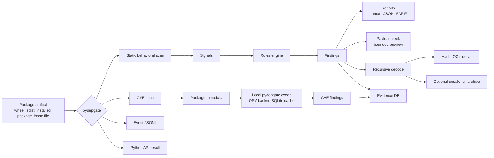
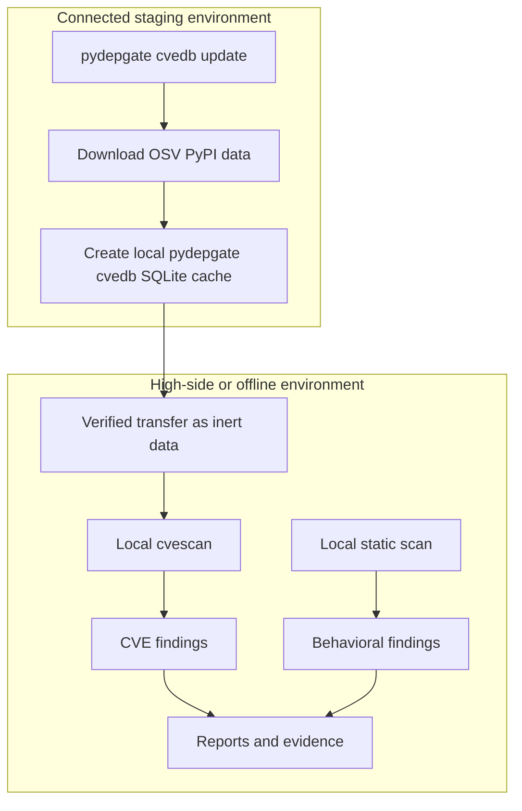
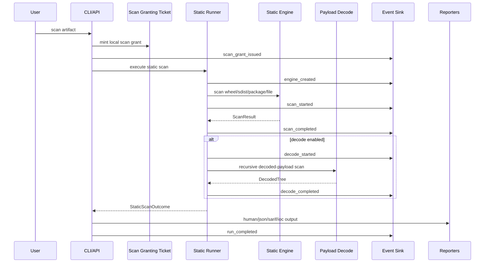
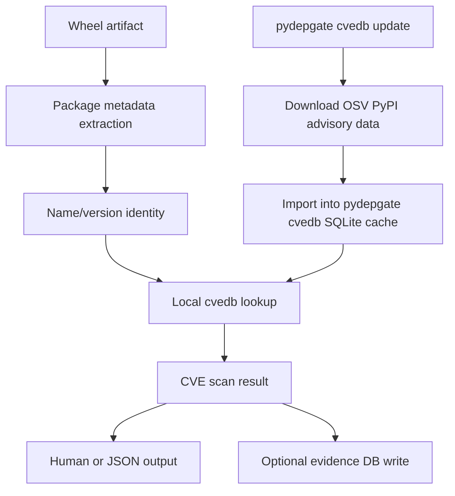

# Threat Model

> Scope: static scanning, CVE scanning, decoded-payload handling, reporting, evidence storage, event logs, and public API surfaces

## Purpose

pydepgate is a security tool that inspects potentially hostile Python package artifacts. Its threat model is stricter than an ordinary developer tool because the tool is expected to read attacker-controlled archives, parse attacker-controlled Python source, inspect attacker-controlled metadata, decode attacker-controlled payload-shaped data, and emit reports that may be consumed by humans, CI systems, SARIF consumers, evidence stores, and future package-ingress workflows.

The core rule is simple:

> pydepgate may inspect hostile input, but it must not execute hostile input, import hostile input, compile hostile input, deserialize hostile input, or re-publish hostile payload material through normal output paths.

This document explains the assumptions, trust boundaries, attack surfaces, safety rules, and future hardening work behind that rule.

## Security goals

pydepgate is designed to:

- Detect suspicious Python package behavior before the package is installed or imported.
- Inspect wheels, source distributions, installed package metadata, package-like trees, and loose files without executing package code.
- Detect known vulnerable package versions using pydepgate's local OSV-backed CVE database.
- Refresh vulnerability intelligence on demand with `pydepgate cvedb update`.
- Support both connected use and high-sided/offline use where vulnerability data is refreshed elsewhere and moved across a boundary as inert data.
- Preserve safe, machine-readable evidence about scans.
- Emit human, JSON, SARIF, IOC sidecar, event-log, and API result outputs without leaking full payload values by default.
- Keep runtime dependencies at zero to avoid making pydepgate depend on the same package ecosystem it is defending.
- Provide explicit unsafe escape hatches only where malware research workflows genuinely require payload material.

## Non-goals

pydepgate does not claim to:

- Prove that a package is safe.
- Execute or sandbox packages dynamically.
- Replace runtime detonation, EDR, sandboxing, or manual reverse engineering.
- Replace known-vulnerability tools such as pip-audit. pydepgate complements them with behavioral artifact analysis and its own local OSV-backed CVE scanner.
- Detect every possible malicious package.
- Interpret every possible Python obfuscation technique.
- Treat remote intelligence as executable code.
- Treat event logs or reports as a secure remote trust boundary by themselves.

## Analysis lanes

pydepgate has two major analysis lanes:

1. **Behavioral artifact scanning** through `pydepgate scan`.
   - Looks for suspicious package behavior, startup vectors, dynamic execution, encoding abuse, suspicious stdlib usage, string obfuscation, density signals, payload peek results, and recursive decoded-payload findings.

2. **Known-vulnerability scanning** through `pydepgate cvescan`.
   - Reads package identity from artifacts and checks it against a local CVE database created by pydepgate.
   - The local database is built and refreshed with `pydepgate cvedb update`.
   - The upstream vulnerability data is OSV PyPI advisory data, the same advisory source family used by pip-audit-class workflows.
   - pydepgate does not depend on pip-audit's local state. It creates and owns its own portable SQLite CVE database.
   - The local CVE database is a derived cache that can be rebuilt from upstream OSV data and moved into high-integrity environments as inert data.

These lanes are intentionally complementary. A package may be behaviorally suspicious with no known CVE. A package may have known CVEs with no suspicious startup-vector behavior. Operators should use both when they need both behavioral and known-vulnerability coverage.



## Deployment modes

pydepgate is written for both connected use and high-integrity offline use.

### Connected mode

In connected mode, pydepgate can refresh its local CVE database directly:

```bash
pydepgate cvedb update
pydepgate cvescan some-package.whl
```

`pydepgate cvedb update` downloads OSV PyPI vulnerability data and imports it into pydepgate's own local SQLite CVE database. Scans then query the local database.

### High-sided or offline mode

In high-sided use, network access may be blocked or tightly controlled. pydepgate's design supports that by separating update operations from scan operations.

A typical high-side workflow is:

1. Refresh or build the OSV-backed CVE database in a connected staging environment.
2. Verify and transfer the database file as inert data.
3. Use `pydepgate cvescan` inside the high-side environment without live network access.
4. Run behavioral static scans locally without any network dependency.
5. Store evidence locally and export reports only through approved channels.

The CVE database is treated as a rebuildable cache. The pydepgate evidence database is different: it contains user-generated scan history and is not assumed to be reconstructable from upstream data.



## Trust boundaries

The main trust boundaries are:

| Boundary | Trusted side | Untrusted side | Main risk |
|---|---|---|---|
| Artifact input | pydepgate parser and enumerators | wheels, sdists, package trees, loose files | Parser crashes, path confusion, malicious metadata, payload material leakage |
| Python parser boundary | parser wrapper | arbitrary bytes and source text | CPython parser/tokenizer exceptions, invalid encodings, null bytes |
| Payload peek/decode boundary | bounded decoder logic | encoded/compressed attacker data | decompression bombs, recursive transform abuse, accidental payload publication |
| Rules boundary | builtin rules and validated user rules | local user-provided rule files | suppression abuse, invalid policy, misclassification |
| CVE data boundary | local cvedb importer/query layer | downloaded/imported OSV advisory data | malformed advisory data, stale data, incorrect range handling |
| Evidence boundary | local evidence database writer | scan result and decoded-tree data | storing payload bytes, schema drift, partial writes |
| Event boundary | event envelope and sinks | event payload producers | non-JSON data, raw bytes, mutation, sink failure |
| API boundary | safe public result objects | caller code | accidental exposure of native internals or decoded payload material |
| Report boundary | reporters | CI logs, issue trackers, SARIF consumers | re-publishing payloads, URLs, commands, or secrets |
| Network boundary | update/download commands | upstream services and registries | tampered downloads, stale intelligence, online-only assumptions |

## Assets

The assets pydepgate is meant to protect include:

- Developer machines and CI runners.
- Python interpreters and virtual environments.
- Package intake workflows.
- Internal mirrors and future warehouse-style dependency ingress points.
- Security teams consuming scan evidence.
- SARIF and JSON consumers.
- Local evidence databases.
- High-side systems where package artifacts must be inspected without live network access.
- Users and maintainers who need to cite findings without republishing the attack content.

## Threat actors

pydepgate assumes attackers may include:

- Malicious package publishers.
- Typosquatters and dependency-confusion actors.
- Maintainer account compromise actors.
- Attackers who publish packages with hostile installation or startup behavior.
- Attackers who hide payloads through encoding, compression, string construction, or transform chains.
- Attackers who attempt to crash or confuse scanners with malformed archives, metadata, source files, encodings, or binary content.
- Attackers who rely on scanners or reports to accidentally republish payload material into logs, SARIF, JSON, issues, or evidence stores.

## Attacker capabilities

pydepgate assumes an attacker can control:

- Wheel contents.
- Source distribution contents.
- Python source files.
- `.pth` files.
- `setup.py`.
- `__init__.py`.
- `sitecustomize.py` and `usercustomize.py`.
- Console entry point metadata.
- Package metadata fields.
- File names and archive internal paths.
- Encoded strings and compressed blobs.
- Unicode characters, invisible characters, homoglyphs, and malformed text.
- Bytes that are not valid Python source.
- Payloads intended to crash parsers or decoders.
- Inputs intended to trigger excessive CPU, memory, or recursion.

pydepgate assumes attackers cannot directly modify pydepgate's installed code unless the host is already compromised. Host compromise is out of scope for the scanner itself, but pydepgate still avoids any runtime dependencies.

## Core invariants

These invariants are load-bearing:

1. **Never execute untrusted package content.**
   pydepgate does not run package code as part of scanning.

2. **Never import untrusted package content.**
   Installed-package discovery uses metadata inspection where possible. Scanning an artifact reads files and metadata, not imports.

3. **Never compile untrusted source.**
   `compile()` is not used on artifact content as a scanner shortcut.

4. **Never deserialize untrusted payloads.**
   Pickle data is detected and classified, never loaded.

5. **Never treat remote intelligence as code.**
   OSV advisory data, CVE records, event logs, and future intelligence feeds are data only.

6. **Never emit full payload material through normal outputs.**
   Human, JSON, SARIF, event logs, safe API findings, and hash IOC outputs should not contain raw payload bytes or decoded source.

7. **Make unsafe behavior explicit and ugly.**
   Full payload archive export requires full-mode decode and explicit unsafe capability tokens in the API.

8. **Prefer local, portable data stores.**
   Online update is separate from local scan.

9. **Fail closed at parser and event boundaries.**
   Malformed input should produce structured parse failure or rejected event payloads, not unhandled exceptions.

10. **Evidence should be hash-bound.**
   Reports should let defenders cite and correlate findings without publishing the underlying payload.

## Static scan pipeline



## CVE scan pipeline

Known-vulnerability scanning is intentionally separated from behavioral static scanning.



The CVE database is refreshable on demand and portable. This matters for environments where the scanning host is not allowed to perform live network lookups.

## Event model

Events are structured telemetry for scan lifecycle, not a payload transport.

Events use immutable envelopes with:

- schema version
- event ID
- event type
- producer
- run ID
- correlation ID
- parent event ID
- ticket ID
- timestamps
- severity
- payload schema label
- payload digest
- JSON-safe payload

Event payloads are validated and deep-frozen. They reject unsafe data shapes such as raw bytes, bytearrays, memoryviews, NaN, infinity, cyclic structures, and non-string mapping keys.

Event logs are JSONL so downstream systems can append, stream, grep, archive, and ingest them without custom framing.

Event logs should never include:

- raw payload bytes
- decoded source
- full encoded payload strings
- command-line payload arguments
- secrets
- URLs extracted from payload material unless explicitly safe and bounded

## Scan Granting Tickets

Scan Granting Tickets are local execution grants. In the current implementation, they are not a remote cryptographic trust boundary. They are a contract that records:

- who or what issued the scan
- actor identity
- target kind
- target identity
- scan mode
- allowed actions
- issue and expiry time
- ruleset fingerprint
- policy fingerprint slot
- execution budget
- local invocation evidence
- stable ticket digest

This lets scan execution move toward an authorized work model instead of loose function calls.

Future daemon, warehouse, and tool-delegation work may strengthen this with signature, delegation, remote identity, or child-ticket semantics.

## Output safety model

pydepgate separates **evidence** from **payload material**.

Allowed in normal output:

- finding IDs
- signal IDs
- severity
- locations
- file paths
- hashes
- sizes
- decode chain metadata
- terminal kind
- bounded payload peek previews when explicitly requested
- SARIF codeFlows that describe the path without embedding payload bytes
- event lifecycle metadata
- JSON-safe summary fields

Not allowed in normal output:

- full encoded payload values
- raw decoded payload bytes
- decoded malware source text
- full command lines extracted from payloads
- secrets found in payload material
- arbitrary native scanner object graphs
- Python objects that cannot be safely serialized as JSON data

Full payload material is allowed only through explicit full-mode malware-research workflows, such as encrypted decoded-payload archive export.

## API safety model

The public Python API is designed for consumers that need scan results without shelling out to the CLI.

Safe API results expose:

- summary fields
- finding counts
- diagnostic counts
- safe finding records
- hash IOC records
- event records
- report rendering through existing reporters
- IOC sidecar writing
- explicit summary serialization

Safe API results block:

- native `ScanResult`
- native runner outcome
- decoded tree internals
- raw payload bytes
- decoded source material

Unsafe access requires capability tokens under `pydepgate.api.UNSAFE`. This is intentionally noisy. A caller asking for native internals or payload archives should look like they are doing something dangerous.

## Reporter safety

SARIF, JSON, and human output serve different consumers, but all normal report paths follow the same content boundary.

SARIF is especially sensitive because SARIF documents are commonly uploaded to code-scanning systems, CI artifacts, and issue trackers. pydepgate's SARIF output is content-blind: it describes behavior without embedding payload bytes.

JSON output is machine-readable but still considered normal output. It should not contain raw decoded payload material.

Human output may include bounded previews when requested with payload peek, but not full payload values.

## Evidence database model

The pydepgate evidence database stores user-generated scan history. It is different from the CVE database.

| Store | Purpose | Rebuildable | Network required for scan |
|---|---|---:|---:|
| `cvedb` | Local OSV-backed vulnerability cache created by `pydepgate cvedb update` | Yes | No |
| `pdgdb/evidence.db` | User scan evidence and history | No | No |

The evidence database may store:

- scan runs
- artifact identity and hashes
- file identity and hashes
- static findings
- decoded tree metadata
- CVE scan runs
- CVE findings

The evidence database should not store raw payload bytes or decoded malware source.

## Threat scenarios and controls

| Scenario | Risk | Control |
|---|---|---|
| Malicious `.pth` file executes on interpreter startup | Startup persistence and pre-user-code execution | Static `.pth` analysis, startup-vector severity rules, no import/execute behavior |
| Encoded payload hides malicious source | Scanner sees only base64 text | payload peek, recursive decode, chain metadata, decoded-payload rescanning |
| Payload uses pickle to trigger code execution if loaded | Scanner becomes execution vector | pickle is detected and classified, never deserialized |
| Compressed payload is a bomb | Memory or CPU exhaustion | bounded in-flight byte budget, depth limits |
| Random binary data crashes parser | Tool crash or CI instability | parser wrappers return structured parse failures and tests cover hostile byte streams |
| JSON/SARIF report republishes payload | Scanner becomes distribution channel | content-blind report construction and safe finding contexts |
| API consumer prints result object | Native object graph leaks | compact repr and blocked native result properties |
| API consumer requests decoded tree | Payload material exposure | blocked by default, unsafe capability token required |
| Hash IOC mode retains decoded source | Payload material remains reachable | hash mode strips decoded source; full mode required for source retention |
| Event payload contains bytes | Event log becomes payload transport | event payload validation rejects raw bytes and non-JSON-safe values |
| Event sink fails | scan failure or silent telemetry loss | strict and non-strict sink modes, warnings or explicit errors |
| Wheel scanned as loose file | meaningless binary-source findings | archive-as-single guardrail in API and runner contract checks |
| Stale CVE database | missed known vulnerabilities | explicit `cvedb update`, status checks, portable database refresh process |
| High-side scanner performs live network lookup | policy or boundary violation | scan and cvescan use local data; update is a separate operator action |

## Security assumptions

pydepgate assumes:

- The Python interpreter running pydepgate is trusted enough to execute pydepgate.
- The installed pydepgate package has not been modified by an attacker.
- The host filesystem and OS enforce normal file permissions.
- Operators understand that `decode_iocs=full` and unsafe API exports are malware-research workflows.
- OSV advisory data is treated as untrusted data and imported through pydepgate's parser/importer, not executed.
- Event logs and reports may be copied into less trusted systems and therefore must avoid payload material by default.

## Residual risks

Known residual risks include:

- Static analysis can miss behavior that only becomes visible through complex runtime state.
- Obfuscation can evade specific analyzers.
- Package metadata can lie.
- Known-vulnerability scanning is only as fresh as the local CVE database.
- Advisory range interpretation can be incomplete for unusual or unsupported version shapes.
- Full-mode decoded payload archives intentionally contain dangerous material.
- Unsafe API capability tokens intentionally allow access to internals.
- Future daemon, warehouse, and policy features will introduce new trust boundaries.

## Future hardening

Planned or expected hardening work includes:

- Policy result objects and policy verdict events.
- Stable finding fingerprint and validation flows.
- Daemon-side intake and emission.
- Warehouse or guarded-install enforcement.
- Stronger ticket delegation and remote identity semantics.
- Signed or hash-bound intelligence feeds.
- Additional parser fuzzing and adversarial corpus testing.
- More explicit high-side operator guidance.
- Threat-model updates as new trust boundaries ship.

## Summary

pydepgate's threat model is built around a narrow but important line:

> Read hostile package artifacts as data. Never run them. Never turn scan output into a second payload channel.

Everything else follows from that: zero runtime dependencies, local data stores, bounded decoding, content-blind reports, hash-only IOC modes, immutable JSON-safe events, explicit unsafe gates, and separate update-versus-scan workflows for both connected and high-integrity environments.
